# TaskScheduler
Schedule your Tasks and addNotes To keep your day smooth
 
<h1>Check Out the Screenshots</h1>

<h>Loading Animations<h>
 
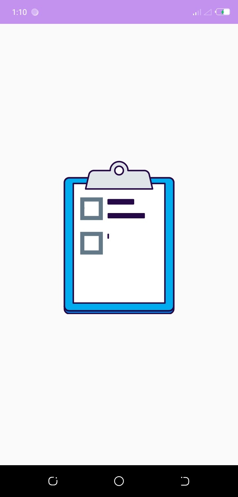
 
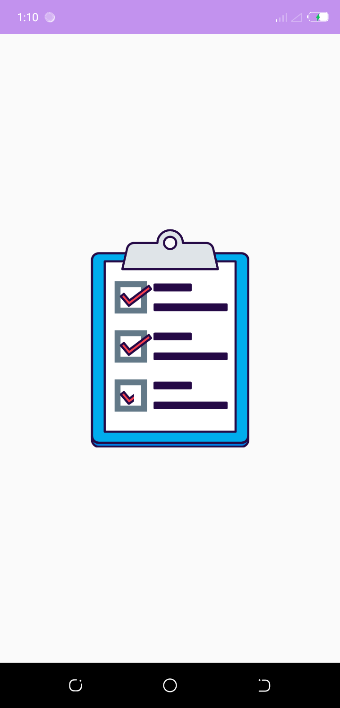
 
WalkThrough screen
 
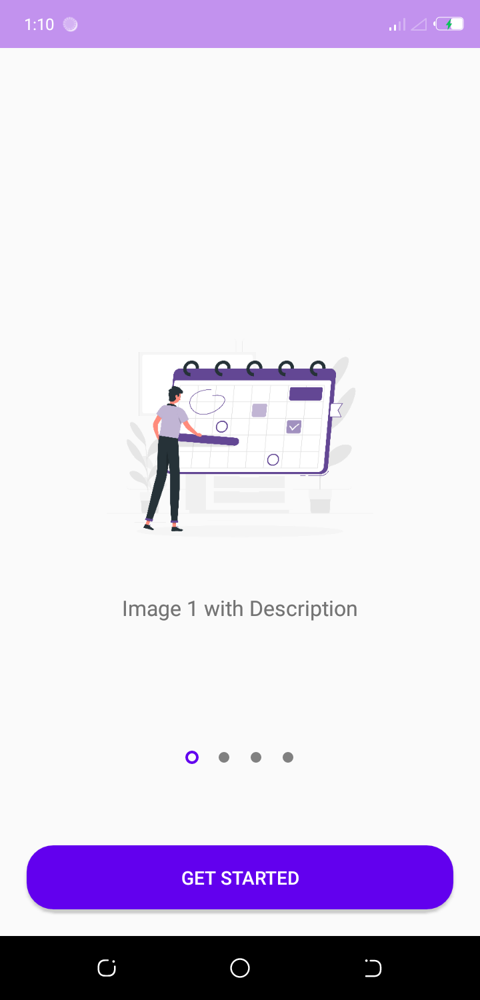
 
Adding a New Task/New Note/New Checklist
 
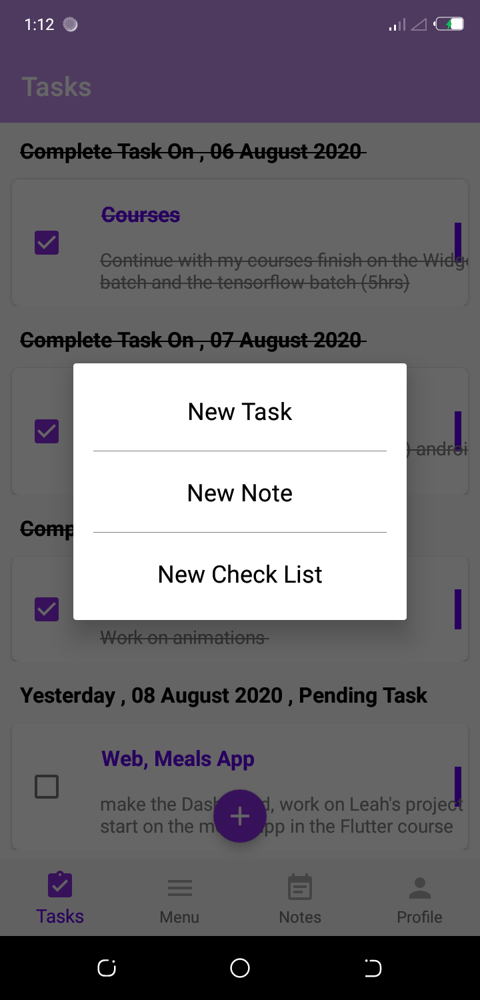
 
Creating a new Task
 
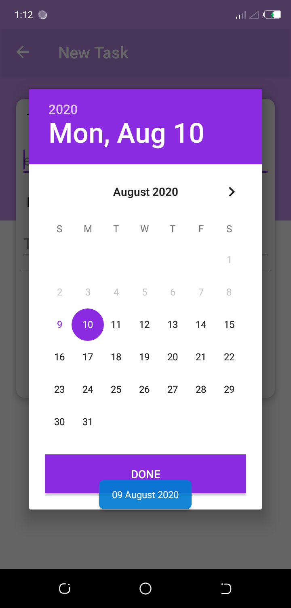
 
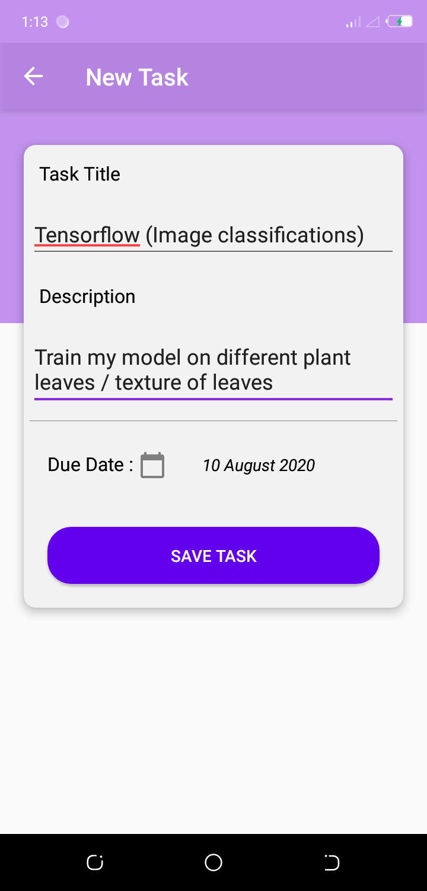
 
The new Task is already Created
 
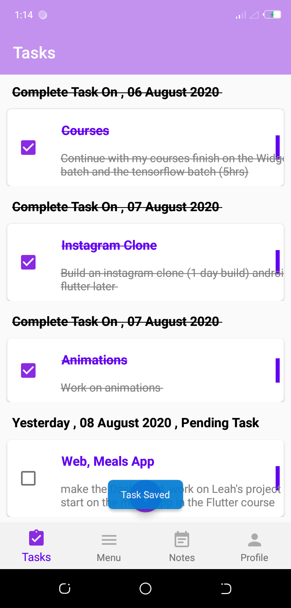
 
Showing Tasks
 
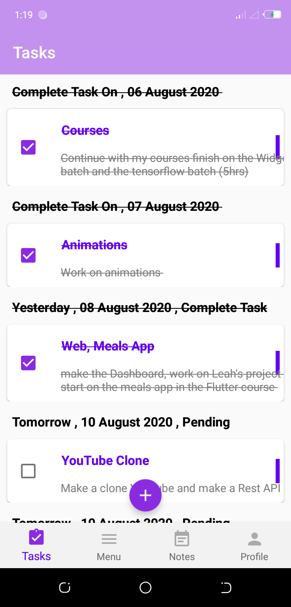
 
Update Task when Completed so that it can be striken through
 
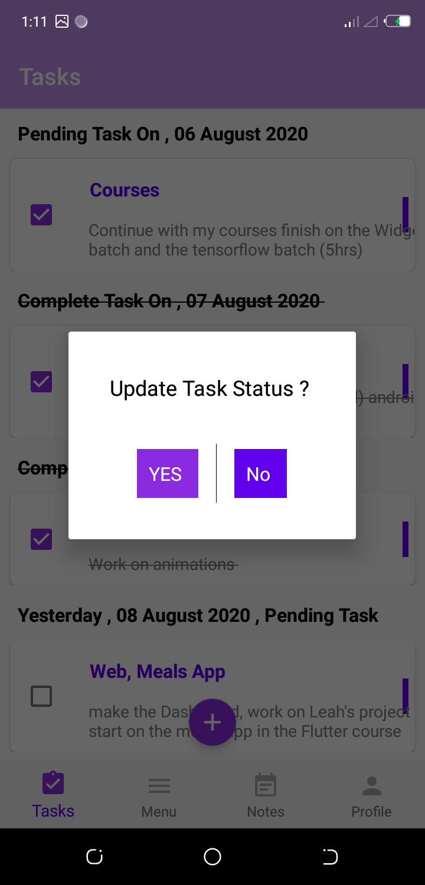
 
You can Delete Task
 
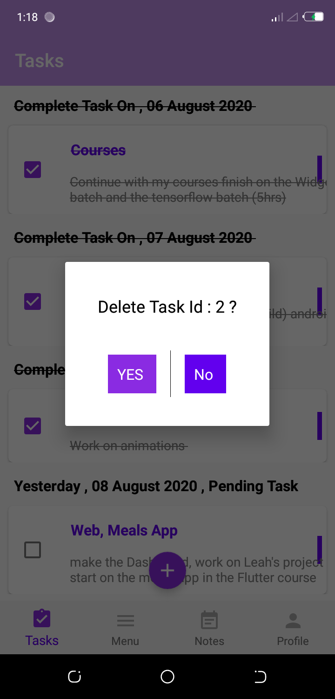
 
An Empty Menu Fragment
 
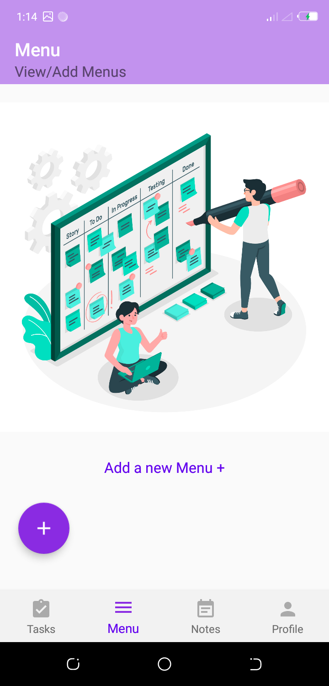
 
Creating a new Menu(Don't mind the button I'll work on it)
 
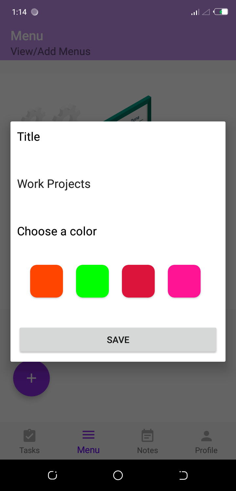
 
Displaying menus
 
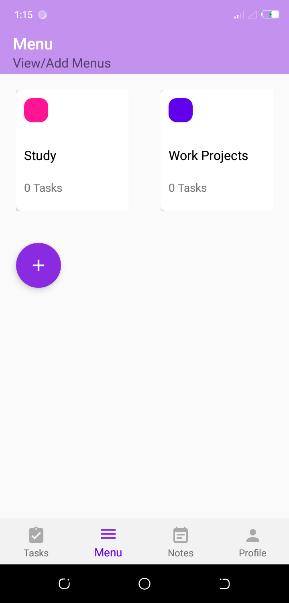
 
creating A new Note
 
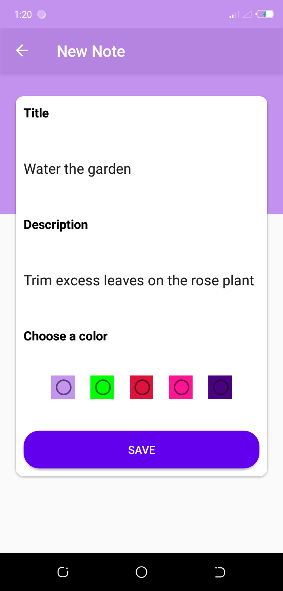
 
Displaying Notes
 
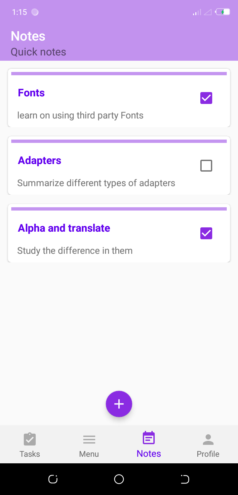
 
Profile,TrackProgress in this fragment
 
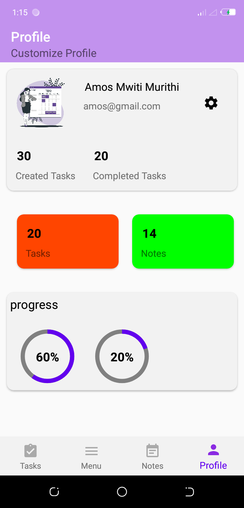
 
<h1>I will be adding more features </h1>
 
<h1>I have already made a desktop application that syncs data with this app</h1>
